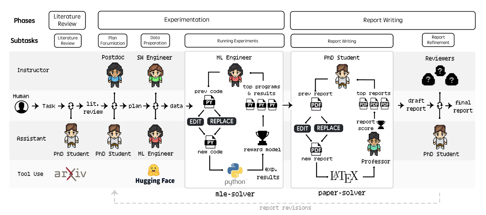

# Agent Laboratory: Usando Agentes LLM como Assistentes de Pesquisa

<p align="center">
  
</p>


<p align="center">
    【<a href="../README.md">English</a> | <a href="../readme/README-chinese.md">中文</a> | <a href="../readme/README-japanese.md">日本語</a> | <a href="../readme/README-korean.md">한국어</a> | <a href="../readme/README-filipino.md">Filipino</a> | <a href="../readme/README-french.md">Français</a> | <a href="../readme/README-slovak.md">Slovenčina</a> | Português | <a href="../readme/README-spanish.md">Español</a> | <a href="../readme/README-turkish.md">Türkçe</a> | <a href="../readme/README-hindi.md">हिंदी</a> | <a href="../readme/README-bengali.md">বাংলা</a> | <a href="../readme/README-vietnamese.md">Tiếng Việt</a> | <a href="../readme/README-russian.md">Русский</a> | <a href="../readme/README-arabic.md">العربية</a> | <a href="../readme/README-farsi.md">فارسی</a> | <a href="../readme/README-italian.md">Italiano</a>】
</p>

<p align="center">
    【🌐 <a href="https://agentlaboratory.github.io/">Website</a> | 💻 <a href="https://github.com/SamuelSchmidgall/AgentLaboratory">Software</a> | 🎥 <a href="https://agentlaboratory.github.io/#youtube-video">Video</a> |  📚 <a href="https://agentlaboratory.github.io/#examples-goto">Example Paper</a> | 📰 <a href="https://agentlaboratory.github.io/#citation-ref">Citation</a>】
</p>

## 📖 Visão Geral

- **Agent Laboratory** é um fluxo de trabalho de pesquisa autônomo de ponta a ponta, destinado a auxiliar **você** como pesquisador humano na **implementação das suas ideias de pesquisa**. O Agent Laboratory consiste em agentes especializados movidos por grandes modelos de linguagem para apoiá-lo durante todo o fluxo de trabalho de pesquisa — desde a condução de revisões de literatura e formulação de planos até a execução de experimentos e a redação de relatórios abrangentes.
- Este sistema não foi projetado para substituir a sua criatividade, mas para complementá-la, permitindo que você se concentre na ideação e no pensamento crítico enquanto automatiza tarefas repetitivas e que consomem muito tempo, como codificação e documentação. Ao acomodar diferentes níveis de recursos computacionais e envolvimento humano, o Agent Laboratory visa acelerar a descoberta científica e otimizar a sua produtividade em pesquisa.

<p align="center">
  
</p>

### 🔬 Como funciona o Agent Laboratory?

- O Agent Laboratory consiste em três fases principais que orientam sistematicamente o processo de pesquisa: (1) Revisão de Literatura, (2) Experimentação e (3) Redação de Relatórios. Durante cada fase, agentes especializados movidos por LLMs colaboram para alcançar objetivos distintos, integrando ferramentas externas como arXiv, Hugging Face, Python e LaTeX para otimizar os resultados. Este fluxo de trabalho estruturado começa com a coleta e análise independentes de artigos de pesquisa relevantes, avança através do planejamento colaborativo e preparação de dados, e resulta em experimentação automatizada e geração de relatórios abrangentes. Detalhes sobre os papéis específicos dos agentes e suas contribuições ao longo dessas fases são discutidos no artigo.

<p align="center">
  
</p>

## 🖥️ Instalação

### Opção de ambiente virtual Python (venv)

1. **Clone o Repositório do GitHub**: Comece clonando o repositório usando o comando:
    ```bash
    git clone git@github.com:SamuelSchmidgall/AgentLaboratory.git
    ```

2. **Configure e Ative o Ambiente Python**
    ```bash
    python -m venv venv_agent_lab
    ```

    - Agora, ative este ambiente:
    ```bash
    source venv_agent_lab/bin/activate
    ```

3. **Instale as bibliotecas necessárias**
    ```bash
    pip install -r requirements.txt
    ```

4. **Instale o pdflatex [OPCIONAL]**
    ```bash
    sudo apt install pdflatex
    ```

    - Isso permite que o código LaTeX seja compilado pelos agentes.
    - **[IMPORTANTE]** Se esta etapa não puder ser executada devido à falta de acesso sudo, a compilação de PDF pode ser desativada executando o Agent Laboratory com a flag --compile_latex definida como false: --compile_latex=False

5. **Agora execute o Agent Laboratory!**

    ```bash
    python ai_lab_repo.py --api-key "API_KEY_AQUI" --llm-backend "o1-mini" --research-topic "SUA IDEIA DE PESQUISA"
    ```

    ou, se você não tiver o pdflatex instalado

    ```bash
    python ai_lab_repo.py --api-key "API_KEY_AQUI" --llm-backend "o1-mini" --research-topic "SUA IDEIA DE PESQUISA" --compile_latex=False
    ```

-----
## Dicas para melhores resultados de pesquisa

#### [Dica #1] 📝 Certifique-se de escrever notas extensas! 📝

**Escrever notas extensas é importante** para ajudar seu agente a entender o que você está tentando realizar em seu projeto, bem como quaisquer preferências de estilo. As notas podem incluir quaisquer experimentos que você deseja que os agentes realizem, fornecendo chaves de API, certos gráficos ou figuras que você deseja incluir, ou qualquer coisa que você queira que o agente saiba ao realizar a pesquisa.

Esta também é sua oportunidade de informar ao agente **a quais recursos de computação ele tem acesso**, por exemplo, GPUs (quantas, que tipo de GPU, quantos GBs), CPUs (quantos núcleos, que tipo de CPUs), limitações de armazenamento e especificações de hardware.

Para adicionar notas, você deve modificar a estrutura task_notes_LLM dentro de ai_lab_repo.py. Abaixo está um exemplo de conjunto de notas usadas em alguns de nossos experimentos.

```python
task_notes_LLM = [
    {"phases": ["plan formulation"],
     "note": f"You should come up with a plan for TWO experiments."},

    {"phases": ["plan formulation", "data preparation",  "running experiments"],
     "note": "Please use gpt-4o-mini for your experiments."},

    {"phases": ["running experiments"],
     "note": f"Use the following code to inference gpt-4o-mini: \nfrom openai import OpenAI\nos.environ["OPENAI_API_KEY"] = "{api_key}"\nclient = OpenAI()\ncompletion = client.chat.completions.create(\nmodel="gpt-4o-mini-2024-07-18", messages=messages)\nanswer = completion.choices[0].message.content\n"},

    {"phases": ["running experiments"],
     "note": f"You have access to only gpt-4o-mini using the OpenAI API, please use the following key {api_key} but do not use too many inferences. Do not use openai.ChatCompletion.create or any openai==0.28 commands. Instead use the provided inference code."},

    {"phases": ["running experiments"],
     "note": "I would recommend using a small dataset (approximately only 100 data points) to run experiments in order to save time. Do not use much more than this unless you have to or are running the final tests."},

    {"phases": ["data preparation", "running experiments"],
     "note": "You are running on a MacBook laptop. You can use 'mps' with PyTorch"},

    {"phases": ["data preparation", "running experiments"],
     "note": "Generate figures with very colorful and artistic design."},
    ]
```

--------
    
#### [Dica #2] 🚀 Usar modelos mais poderosos geralmente leva a melhores pesquisas 🚀

Ao conduzir pesquisas, **a escolha do modelo pode impactar significativamente a qualidade dos resultados**. Modelos mais poderosos tendem a ter maior precisão, melhores capacidades de raciocínio e melhor geração de relatórios. Se os recursos computacionais permitirem, priorize o uso de modelos avançados como o1-(mini/preview) ou modelos de linguagem grandes de última geração similares.

No entanto, **é importante equilibrar desempenho e custo-benefício**. Embora modelos poderosos possam gerar melhores resultados, eles geralmente são mais caros e consomem mais tempo para serem executados. Considere usá-los seletivamente — por exemplo, para experimentos chave ou análises finais — enquanto confia em modelos menores e mais eficientes para tarefas iterativas ou prototipagem inicial.

Quando os recursos são limitados, **otimize ajustando modelos menores** no seu conjunto de dados específico ou combinando modelos pré-treinados com prompts específicos para a tarefa para alcançar o equilíbrio desejado entre desempenho e eficiência computacional.

-----

#### [Dica #3] ✅ Você pode carregar salvamentos anteriores a partir de checkpoints ✅

**Se você perder o progresso, conexão com a internet ou se uma subtarefa falhar, você sempre pode carregar a partir de um estado anterior.** Todo o seu progresso é salvo por padrão na variável state_saves, que armazena cada checkpoint individual. Basta passar os seguintes argumentos ao executar ai_lab_repo.py

```bash
python ai_lab_repo.py --api-key "API_KEY_AQUI" --research-topic "SUA IDEIA DE PESQUISA" --llm-backend "o1-mini" --load-existing True --load-existing-path "save_states/LOAD_PATH"
```

-----

#### [Dica #4] 🈯 Se você estiver executando em um idioma diferente do inglês 🈲

Se você estiver executando o Agent Laboratory em um idioma diferente do inglês, sem problema, apenas certifique-se de fornecer uma flag de idioma para que os agentes realizem a pesquisa no seu idioma preferido. Observe que não estudamos extensivamente a execução do Agent Laboratory em outros idiomas, portanto, certifique-se de relatar quaisquer problemas que encontrar.

Por exemplo, se você estiver executando em chinês:

```bash
python ai_lab_repo.py --api-key "API_KEY_AQUI" --research-topic "SUA IDEIA DE PESQUISA (no seu idioma)" --llm-backend "o1-mini" --language "中文"
```

----

#### [Dica #5] 🌟 Há muito espaço para melhorias 🌟

Há muito espaço para melhorar esta base de código, então se você acabar fazendo alterações e quiser ajudar a comunidade, sinta-se à vontade para compartilhar as mudanças que você fez! Esperamos que esta ferramenta lhe seja útil!

## Referência / Bibtex

```bibtex
@preprint{schmidgall2025AgentLaboratory,
  title={Agent Laboratory: Using LLM Agents as Research Assistants},
  author={Schmidgall, Samuel and Su, Yusheng and Wang, Ze and Sun, Ximeng and Wu, Jialian and Yu, Xiadong and Liu, Jiang, Liu, Zicheng and Barsoum, Emad},
  year={2025}
}
```
